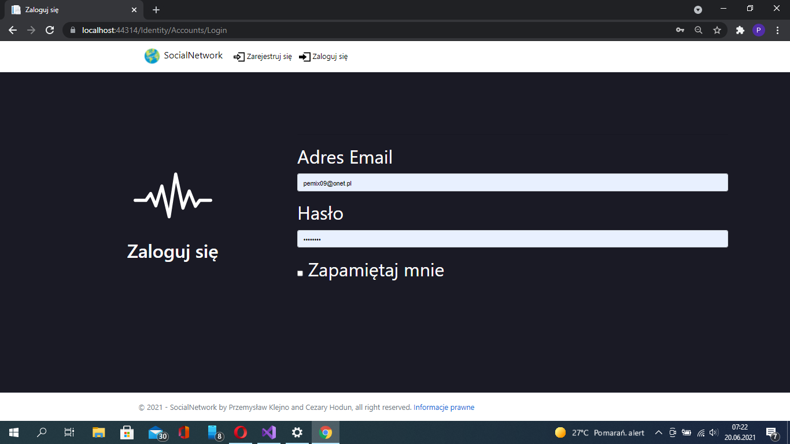

# SocialNetwork
Sieć społecznościowa, która jest innowacyjna, ze względu na podejście na prywatność danych użytkownika jak i swój wygląd

## Zrzuty ekranu:
Strona startowa:

Dodawanie komentarzy do postów:

Ekran logowania:

Ekran rejestracji:

Panel administratora:

Strona wiadomości:

Wyszukiwanie użytkowników:

Posty znajomych:

## Zastosowane Technologie:
- Javascript
- Jquery
- CSS
- HTML
- C#
- .NET Core Razor Pages

## Projekt nie będzie więcej rozwijany, nowa wersja:
